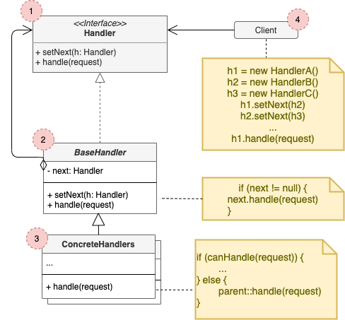

# Chain of Responsibility

## Concept

_Behavioral Design Pattern that lets you pass requests along a chain of handlers. Upon receiving a request, each handler decides either to process the request or to pass it to the next handler in the chain._

### Problem

* You're working on an online ordering system. You want to restric creating orders to authenticated users, and full access to admins.
* You realize these checks must be performed sequentially (if one validation fails, the next doesn't need to be executed).
* After some time you need to add extra validations.

### Solution

* The **Chain of Responsibility** relies on transforming particular behaviors into stand-alone objects called *handlers*, and link then into a chain.
* A handler can decide not to pass the request further down the chain.
* There's a slightly different approach, in which, upon receiving a request, the handler can decide to process it and doesn't pass the request any further. This is very common when dealing with events in stacks of elements within a graphical interface.

## Structure

1. The **Handler** declares the interface, common for all concrete handlers. Usually contains a single method for handling requests, but can also have one for setting the next handler on the chain.
2. The **Base Handler** is an optional class where you can put the boilerplate code that's common to all handlers.
3. **Concrete handlers** contain the actual code for processin requests. Usually are self-contained an inmutable, accepting all necessary data just once via the constructor.
4. The **Client** may compose chains just once or compse them dinamically.

## Pros and Cons

### Pros

* You can control the order of request handling.
* *Single Responsibility Principle*.
* *Open/Closed Principle*.

### Cons

* Some requests may end up unhandled.
