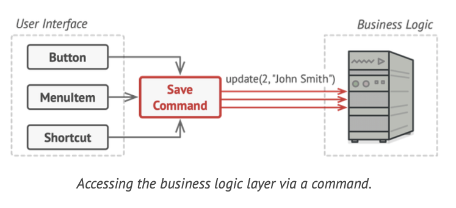
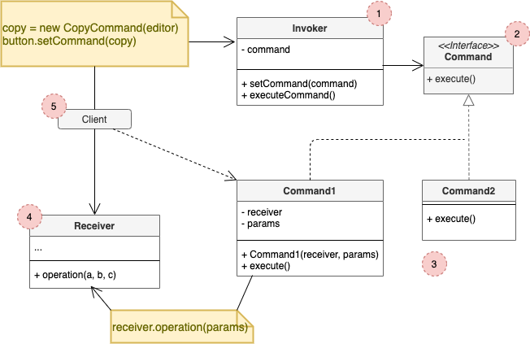

# Command

## Concept

_Behavioral Design Pattern that turns a request into a stand-alone object that contains all information about the request. This transformation lets you pass requests as a method arguments, delay or queue a request's execution, and support undoable operations._

### Problem

* You're working on a text-editor app. You need to create a toolbar with a bunch of buttons for various operations of the editor. You created a very neat `Button` class that can be used for buttons on the toobal, as well as generic ones.
* The buttons are similar, but they're supposed to do different things. Where to put the click handlers of these buttons?
* Tons of subclasses could be an option, but it's flawed. There could be an enormous number of them, that could break if the base class is modified.

### Solution

* Separate the app in GUI layer and business logic layer.
* The GUI calls a method of a business logic object, passing it some arguments. This process is known as *request*.
* The Command pattern suggests that GUI objects shouldn't send these requests directly. Instead, we should extract all of the request details, such as the object being called, the name of the method and the list of arguments into a separate *command* class with a single method that triggers this request.

* Then we have to make the commands implement the same interface. Usually it has just a single execution method that takes no parameters.
* The request parameters shoudl be pre-configured in the command or capable of getting it on its own.

## Structure

1. The **Sender** class (aka *invoker*) is responsible for initiating requests. This class must have a field for storing a reference to a command object. The sender triggers that command instead of sending the request directly to the receiver. Note that the sender isn't responsible for creating the command object. Usually, it gets a pre-created command from the client via the constructor.
2. The **Command** interface usually declares just a single method for executing the command.
3. **Concrete Commands** implement various kinds of requests. A concrete command isn't supposed to perform the work on its own, but rather to pass the call to one of the business logic objects.
4. The **Receiver** class contains some business logic. Almost any object may act as a receiver. Most commands only handle the details of how a request is passed to the receiver, while the receiver itself does the actual work.
5. The **Client** creates and configures concrete command objects. The client must pass all of the request parameters, including a receiver instance, into the command's constructor.

## Pros and Cons

### Pros

* *Single Responsibility Principle*.
* *Open/Closed Principle*.
* You can implement undo/redo.
* You can implement deferred execution of operations.
* You can assemble a set of simple commands into a complex one.

### Cons

* The code may become more complicated since you're introducing a whole new layer between senders and receivers.
