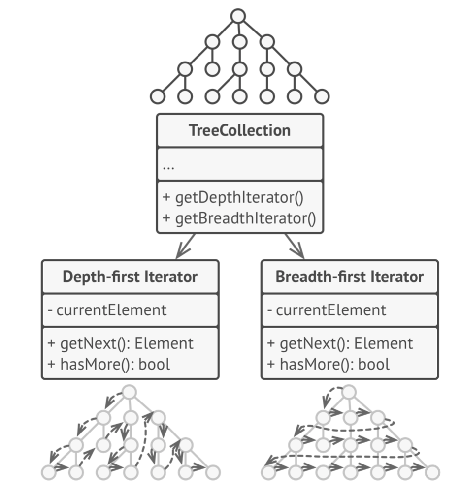
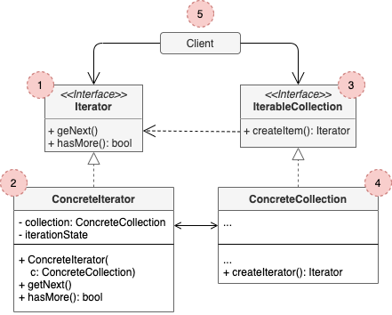

# Iterator

## Concept

_Behavioral Design Pattern that lets you traverse elements of a collection without exposing its underlying representation (list, stack, tree, etc.)._

### Problem

* Collections are one of the most used data types in programming. Nonetheless, a collection is just a container for a group of objects.
* There should be a way to go through ach element of the collection without accessing the same elements over and over. This is easy on lists, but how do you sequentially traverse elements of a complex data structure, such as a tree?
* Adding more and more traversal algorithms to the collection gradually blurs its primary reponsibility –efficient data storage–.
* The client code that's supposed to work with various collections may not even care how they store their elements. However, since collections provide different ways of accessing their elements, you have no option other than to couple your code to the especific collection classes.

### Solution

* Extract the traversal behavior of a collection into a separate object called an _iterator_.
* In addition to implementing the algorithm, an iterator object encapsulates al of the traversal details, such as the current position and how many elements are left till the end.
* Because of this, several iterators can go through the same collection at the same time, independently of each other.

## Structure

1. The **Iterator** interface declares the operations required for traversing a collection: fetching the next element, retrieving the current position, restarting the iteration, ect.
2. **Concrete Iterators** implement specific algorithms for traversing a collection. The iteratior object should track the traversal progress on itrs own. This allows several iterators to traverse the same collection independently of each other.
3. The **Collection** interface declare one or multiple methods for getting iterators compatible with the collection.
4. **Concrete Collections** return new instances of a particular concrete iterator class each time the client requests one.
5. The **Client** works with both collections and iterators via their interfaces, so it isn't coupled to concrete classes. Typically, clients don't create iterators on their own, but get them from collections, but they can create them in certain cases, e.g. when the client defines its own special iterator.

## Pros and Cons

### Pros

* *Single Responsibility Principle*.
* *Open/Closed Principle*.
* You can iterate over the same collection in parallel because each iterator object contain its own iteration state.
* For the same reason, you can delay an iteration and continue it when needed.

### Cons

* Applying the pattern can be an overkill if your app only works with simple collections.
* Using an iterator may be less efficient than going through elements of some specialized collections directly.
