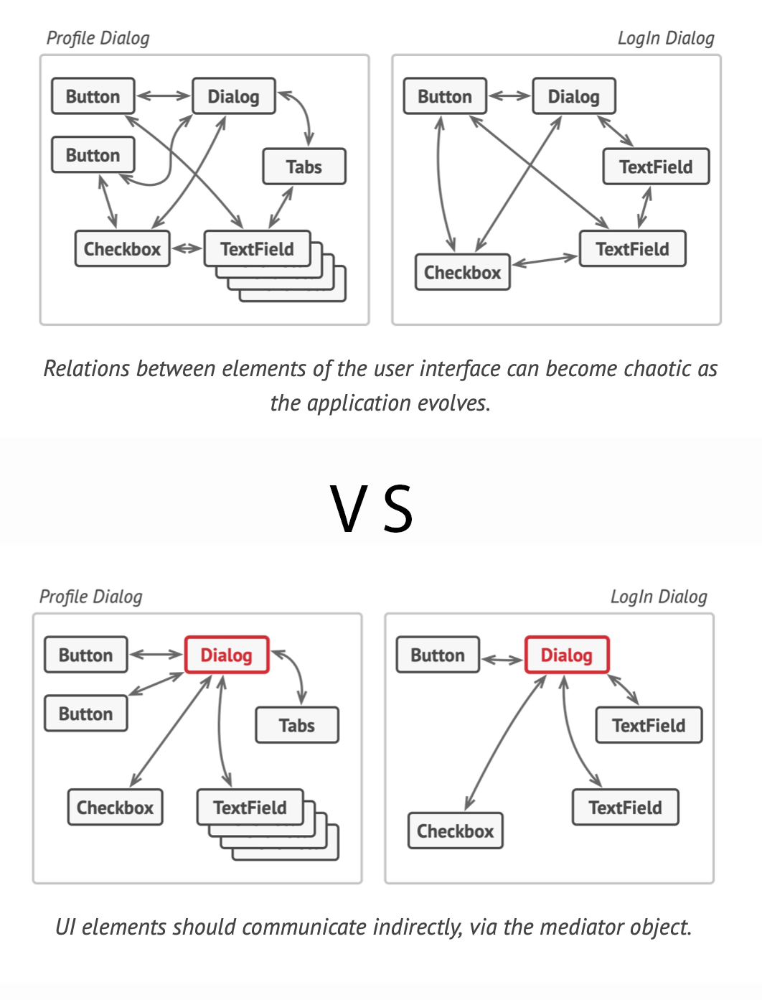
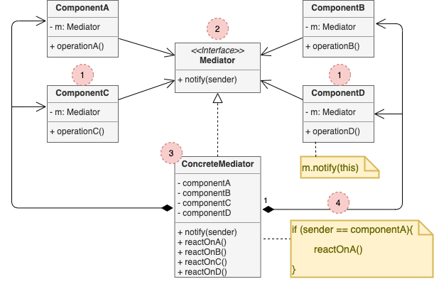

# Mediator

*a.k.a Intermediary, Controller*

## Concept

_Behavioral Design Pattern that lets you reduce chaotic dependencies between objects. The pattern restricts direct communications between the objects and forces them to collaborate only via a mediator object._

### Problem

* You have a dialog for creating and editing customer profiles. It consists of various form controls such as text fields, checkboxes, buttons, etc.
* Some of the form elements may interact with others. E.g. a checkbox that enables a text field.
* By having this logic implemented directly inside the code of the form elements, you make these elements' classes much harder to reuse.

### Solution

* The *Mediator* pattern suggests that you should cease all direct communication between the components which you want to make independent of each other. Instead, they must collaborate indirectly, by calling a mediator.

## Structure

1. **Components** are various classes that contain some bisiness logic. Each component has a reference to the mediator, declared with the type of mediator interface. The component isn't aware of the actual class of the mediator, so you can reuse the component in other programs by linking it to a different mediator.
2. The **Mediator** interface declares methods of communication with components, which usually include just a single notificaton method. Components may pass any context as arguments of this method, including their own objects, but only in shuch a way that no coupling occurs between a receiving component and the sender's class.
3. **Concrete Mediators** encapsulate relations between various components. Concrete mediators often keep references to all components they manage and sometimes even manager their lifecycle.
4. Components must not be aware of other components.

## Pros and Cons

### Pros

* *Single Responsibility Principle*.
* *Open/Closed Principle*.
* You can reduce coupling between various components of a program.
* You can reuse individual components more easily.

### Cons

* Over time a mediator can evolve into a **[God Object](https://en.wikipedia.org/wiki/God_object)**
