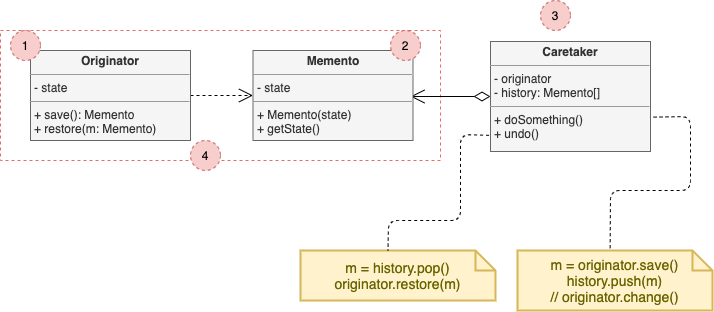
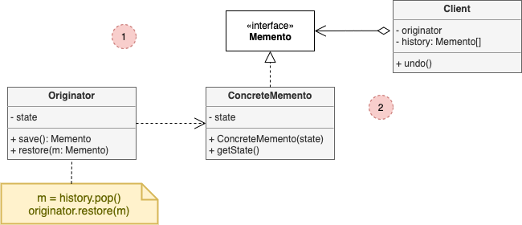

# Memento

*a.k.a Snapshot*

## Concept

_Behavioral Design Pattern that lets you save and restore the previous state of an object without revealing the details of is implementation._

### Problem

* You're creating a text editor app. In addition to simple text editing, it can format text, insert inline images, etc.
* You decide to let users undo any operations cariied out on the text.
* You take the direct approach: Before performing any operation, the app records the state of all objects and save it into some storage.
* Problem 1: Most real objects won't let others peek inside them easily. Making all fields public is a not always a good idea.
* Problem 2: You might decide to refactor some of the editor classes, add or remove some of the fields. This will also require changing the classes responsible for copying the state of the affected objects.

### Solution

* The problems aforementioned are cause by broken encapsulation. Some objects try to do more than they are supposed to. To collect the data required to perform some action, they invade private space of other objects instead of letting these objects perform the actual action.
* The **Memento** pattern delegates creating the state snapshots to the actual owner of the state, the *originator* object. The pattern suggests storing the copy of the object's state in a special object called *memento*.
* The contents of the memento are not accesible to any other object except the one that produced it. Other objects can communicate with it using a limited interface.
* This restrictive policy lets you store mementos inside other objects –usually called *caretakers*–.

## Structure

### Implementation based on nested classes

The classic implementation of the pattern relies on support for nested classes.

1. The **Originator** class can produce snapshots of its own state, as well as restore its state from snapshots when needed.
2. The **Memento** is a value object that acts as a snapshot of the originator's state. It's a common practice to make the memento immutable and pass it the data only once, via the constructor.
3. The **Caretaker** knows not only "when" and "why" to capture the originator's state, but also when the state should be restored. It can keep track of the originator's story by storing a stack of mementos. When the originator has to travel back in history, the caretaker fetches the topmost memento from the stack and passes it to the originator's restoration method.
4. In this implementation, the memento class is nested inside the originator. This lets the originator access the fields and methods of the memento, even thoigh they're declared private. On the other hand, the caretaker has very limited access to the memento's fields and methods, which lets it store mementos in a stack but not tamper with their state.

### Implementation based on an intermediate interface

There's an alternative implementation, suitable for programming languages that don't support nested classes.

1. This implementation allows having multiple types of originators and mementos. Each originator works with a corresponding memento class. Neither originators nor mementos expose their state to anyone.
2. Caretakers are now explicitly restricted from changing the state stored in mementos. Moreover, the caretaker class becomes independent from the originator beacause the restoration method is now defined in the memento class.
3. Each memento becomes linked to the originator that produced it. The originator passes itself to the memento's constructor, along with the value of its state. Thanks to the close relationship between these classses, a memento can restore the state of its originator, given that the latter has defined the appropiate setters.

## Pros and Cons

### Pros

* You can produce snapshots of the object's state without violating its encapsulation.
* You can simplify the originator's code by letting the caretaker maintain the history of the originator's state.

### Cons

* The app might consume lots of RAM if clients create mementos too often.
* Caretakers should track the originator's lifecycle to be able to destroy obsolete mementos.
* Most dynamic programming languages, shuch as PHP, Python and JavaScript can't guarantee that the state within the memento stay untouched.
