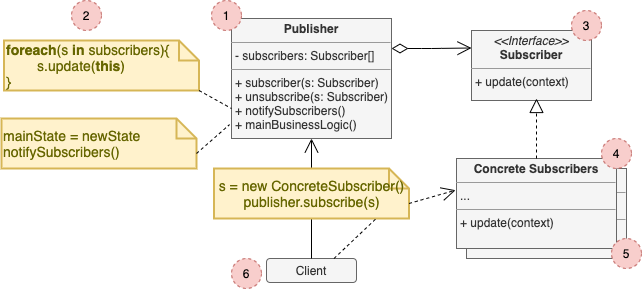

# Observer

*a.k.a Event-Subscriber, Listener*

## Concept

_Behavioral Design Pattern that lets you define a subscription mechanism to notify multiple objects about any events that happen to the object they're observing._

### Problem

* You have two types of objects: a `Customer` and a `Store`. The customer is very interested in a particualr brand of product (e.g. a new model of iPhone) which should become available in the store very soon.
* The customer could visit the store every day and check product availability, but while the product is still en route, most of these trips would be pointless.
* THe store could send tons of emails to all costumer each time a new product becomes available. This would upset the customers who aren't interested in new products.

### Solution

* The object that has some interesting state is often called *subject*, but since it's gonna notify, we'll call it *publisher*. All other objects that want to track changes are called *subscribers*.
* The Observer pattern suggests that you add a subscription mechanism to the publisher class, so individual objects can subscribe or unsuscribe from a stream of events coming from that publisher.

## Structure

1. The **Publisher** issues events of interest to other objects. These events occur when the publisher changes its state or executes some behaviors. Publishers contain a subscription infrastructure that lets new subscribers join and current subscribers leave the list.
2. When a new event happens, the publisher goes over the subscription list and calls the notification method declared in the subscriber interface on each subscriber object.
3. The **Subscriber** interface declares the notification interface. In mot cases, it consists of a single `update` method. The method may have several parameters that let the publisher pass some event details along with the update.
4. Concrete **Subscribers** perform some actions in response to the notification issued by the publisher.
5. Usually, subscribers need some contextual information to handle the update correctly. For this reason, publishers often pass some context data as arguments of the notification method. The publisher can pass itself as an argument, letting subscriber fetch any required data directly.
6. The **Client** creates publisher and subscriber objects separately and then registers subscribers for publisher updates.

## Pros and Cons

### Pros

* *Open/Closed Principle*
* You can establish relations between objects at runtime.

### Cons

* Subscribers are notified in random order.
