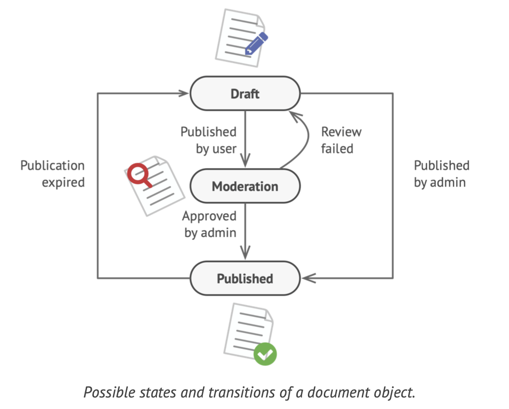
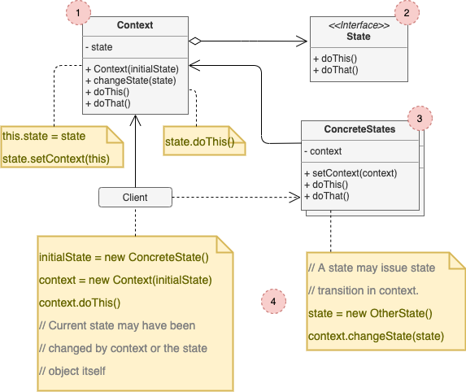

# State

## Concept

_Behavioral Design Pattern that lets an object alter its behavior when its internal state changes. It appears as if the object changed its class._

### Problem

* Closely related to the concept of a [Finite State Machine](https://en.wikipedia.org/wiki/Finite-state_machine): At any given moment, there a *finite* number of *states* which a program can be in; within each of these, the program behaves differently, and the program can transition between states instantaneously.

* We can use if/sitwch statements to handle the different states. The biggest weakness of a state machine based on conditionals reveals itself once we start adding more a more states and state-dependent behaviors to the class.

### Solution

* The **State** pattern suggests that you create new classes for all possible states of an object and extract all state-specific behaviors into these.
* Insted of implementing all behaviors on its own, the original object, called *context*, stores a reference to one of the state objects that represent its current state, and delegates all the state-related work to that object.

## Structure

1. **Context** stores a reference to one of the concrete state objects and delegates to it all state-specific work. The context communicates with the state object via the state interface. The context exposes a setter for passing it a new state object.
2. The **State** Interface declares the state-specific methods. These should make sense for all concrete states because you don't some of your states to have useless methods that will never be called.
3. **Concrete States** provide their own implementations of the state-specific methods. To avoid duplication across states, you may provide intermediate abstract classes that encapsulate some common behavior. State objects may store a backreference to the context object.
4. Both context and concrete states can set the next state of the context and perform the actual state transition by replacing the state object linked to the context.

## Pros and Cons

### Pros

* *Single Responsibility Principle*
* *Open/Closed Principle*
* Simplify the code of the context by eliminating bulky state machine conditionals.

### Cons

* Applying the pattern can be overkill if a state machine has only a few states or rarely changes.
