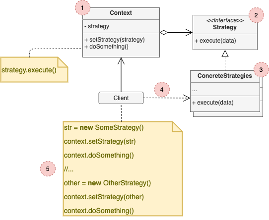

# Strategy

## Concept

_Behavioral Design Pattern that lets you define a family of algorithms, put each of them into a separate class, and make their objects interchangeable._

### Problem

* On day you decided to create a navigation app for casual travelers.
* One of the most requested features for the app was automatic route planning.
* The first version of the app could only build the routes over roads. Next update, you added option to build walking routes. Then another one for public transport.
* That's only the beginning, then you planed to add route for cyclists, then for through all of city's tourist atractions.

### Solution

* The **Strategy** pattern suggests that you take a class that does something specific in a lot of different ways and extract all of these algorithms into separate classes called *strategies*.
* The original class, called *context*, must have a field for storing a reference to one of the strategies. The context delegates the work to a linked strategy object, instead of executing it on its own.
* The context isn't responsible for selecting an appropiate algorithm for the job. Instead, the client passes the desired stategy to the context. In fact, the context doesn't know much about strategies.
* In out navigation app, each routing algorithm can be extracted to its own class with a single `buildRoute` method.

## Structure

1. The **Context** mantains a reference to one of the concrete strategies and communicates with this object only via the strategy interface.
2. The **Strategy** interface is common to al concrete strategies. It declares a method the context uses to execute a strategy.
3. **Concrete Strategies** implement different variations of an algorithm the contxet uses.
4. The context calls the execution method on the linked strategy object each time it needs to run the algorithm. The context doesn't know what type of strategy it works with or how the algorithm is executed.
5. The **Client** creates a specific strategy object and passes it to the context. The context exposes a setter which lets clients replace the strategy associates with the context at runtime.

## Pros and Cons

### Pros

* You can swap algorithms used inside an object at runtime.
* You can isolate the implementation details of an algorithm from the code that uses it.
* You can replace inheritance with composition.
* *Open/Closed Principle*.

### Cons

* If you only have a couple of algorithms and they rarely change, there's no real reason to overcomplicate the code.
* Clients must be aware of the differences between the strategies to be able to select a proper one.
* A lot of modern programming languages have functional type support that lets you implement different versions of an algorithm inside a set of anonymous functions. Then you could use these functions exactly as you'd have user the strategy objects, but withouth bloating the code.
