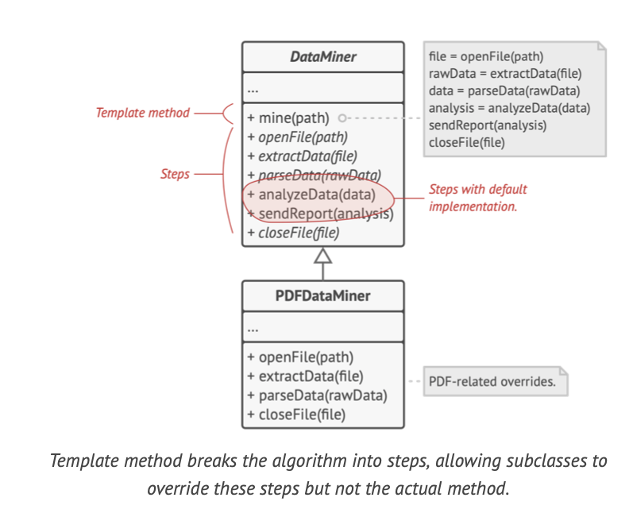
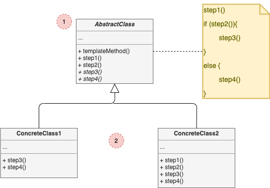

# Template Method

## Concept

_Behavioral Design Pattern that defines the skeleton of an algorithm in the superclass but lets subclasses override specific steps of the algorithm withouth changing its structure._

### Problem

* You're creating a data mining application that analyzes corporate documents. Users feed the app documents in various formats (PDF, DOC, CSV), and it tries to extract meaningful data from these docs in a uniform format.
* The first version could only work with DOC files. In the following version, it was able to support CSV, then you "taught" it to extract data from PDF files.
* At some point, you noticed that all three classes have a lot of similar code.

### Solution

* The **Template Method** pattern suggests that you break down an algorithm into a series of steps, turn these steps into a methods, and put a series of calls to these methods inside a single *template method*. These methods may either be `abstract` or have some default implementation.
* To use this algorithm, the client is supposed to provide its own subclass, implement all abstract steps, and override some of the optional ones if needed (but not the template method itself).

* *Abstract steps* must be implemented by every subclass.
* *Optional steps* already have some default implementation, but still can be overriden if needed.
* There's another type of step, called *hooks*, which is optional and has an empty body. A template method should work even if a hook isn't overriden.

## Structure

1. The **Abstract Class** declares methods that act as steps of an algorithm, as well as the actual template method which calls these methods in specific order. The steps may either be declared abstract or have some default implementation.
2. **Concrete Classes** can override all of the steps, but not the template method itself.

## Pros and Cons

### Pros

* You can let clients override only certain parts of a large algorithm, making them less affected by changes that happen to other parts of the algorithm.
* You can pull the duplicate code into a superclass.

### Cons

* Some clients may be limited by the provided skeleton of an algorithm.
* Yoy night violate the *Liskov Substitution Principle* by suppressing a default step implementation via a subclass.
* Template methods tend to be harder to maintain the more steps they have.
