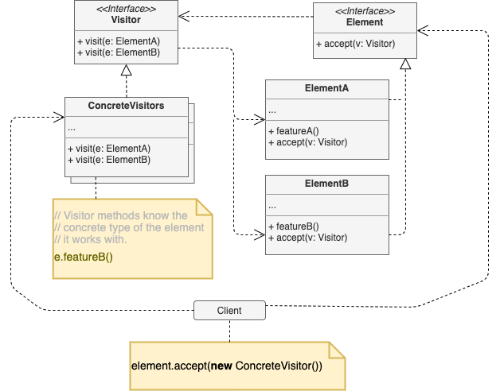

# Visitor

## Concept

_Behavioral Design Pattern that lets you separate algorithms from the objects on which they operate._

### Problem

* You're developing an app which works with geographic information structured as one colossal graph. Each node of the graph represent a complex entity such as a city, but also more granular things like industries, sightseeing areas, etc. Each node type is represented by its own class, while each specific node is an object.
* At some point, you got a task to implement exporting the graph into XML format. You planned to add an export method to each node and then leverage recursion to go over each node of the graph, executing the export method.
* Unfortunately, the system architect refused to allow you to alter existing node classes. It is higly likely that after this feature was implemented, someone from the marketing department would ask you to provide the ability to import into a dfferent format. This would force to change those precious and fragile classes again.

### Solution

* The **Visitor** pattern suggests that you place the new behavior into a separate class called *visitor*, instead of trying to integrate into existing classes. The original object is passed to one of the visitor's method as an argument, providing the method access to all necessary data contained within the object.
* The inplementation will be different across various node classes, so we need to declare a set of methods:

```py
class ExportVisitor(Visitor):
  def do_for_city(self, c: City):
    ...
  def do_for_industry(self, f: Industry):
    ...
  def do_for_sight_seeing(self, ss: SightSeeing):
    ...
```

* So, how do we call these methods when dealing with the whole graph, since they have different signatures. We shouldn't use lots of if statements.
* The Visitor pattern addresses this problem. It uses a technique called <ins>**Double Dispatch**</ins>, which helps to execute the proper method on an obejct without cumbersome conditionals.

```py
# Client code
for node in graph:
  node.accept(export_visitor)

# City
class City:
  def accept(self, v: Visitor):
    v.do_for_city(self)
    ...

# Industry
class Industry:
  def accept(self, v: Visitor):
    v.do_for_industry(self)
    ...
```

* We did have to change the node classes, but the change is trivial, and lets us add further behaviors without altering the code once again.
* Now, if we extract a common interface for all visitors, all existing nodes can work with any visitor you introduce into the app.

## Structure



1. The **Visitor** interface declares a set of visiting methods that can take concrete elements of an object structure as arguments. These methods may have the same names if the program is written in a language that supports overloading, but the type of their paramenters must be different.
2. Each **Concrete Visitor** implements several versions of the same behaviors, tailored for different concrete element classes.
3. The **Element** interface declares a method for *"accepting"* visitors. this method should have one parameter declared with the type of the visitor interface.
4. Each **Concrete Element** must implemnet the acceptance method. The purpose of this method is is to redirect the call to the proper visitor's method corresponding to the current element class.
5. The **Client** usually represents a collection or some other complex object (e.g. a <ins>**Composite**</ins>). Usually, clients aren't aware of all the concrete element classes because they work with object from that collection via some abstract interface.

## Pros and Cons

### Pros

### Cons
