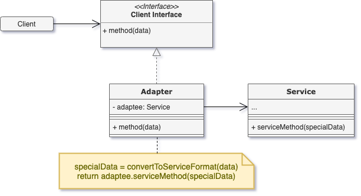
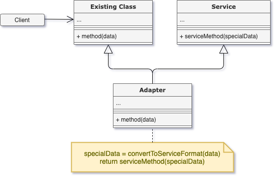

# Adapter

## Concept

_Structural design pattern that allows objects with incompatible interfaces to collaborate._

E.g. Stock Market App

### Problem

- Donwloads data in XML
- Needs to pass data as JSON to a third party Analytics Library

### Solution

* Create an adapter: Special object that converts the interface of one object so that another can understand it.
* An adapter wraps the complex object which handles the logic, the latter is not aware of the former.

1. The adapter gets an interface, compatible with one of the existing objects.
2. Using this interface, the existing object can safely call the adapter's method.
3. Upon receiving a call, the adapter passes the request to the second object, with a compatible format.

\* Can work in both directions.

## Structure

### Object Adapter

Uses composition. Adapter implements the interface of one object and wraps the other one.

1. **Client**: Class containing business logic
2. **Client Interface**: Describes a protocol that other classes must follow to collaborate with the client code.
3. **Service**: Useful class, usually 3rd-party.
4. **Adapter**: Class that's able to work with the client and the service, implements the client interface and translate them into calles to the wrapped service object in a format it understands.

### Class Adapter

Uses inheritance: The adapter inherits interfaces from both objects at the same time.

Doesn't need to wrap any objects because it inherits behaviours from both the client and the service. The adaptation happens within the overridden methods.

## Pros and Cons

### Pros

1. _Single Responsability Principe_
2. _Open/Closed Principle_

### Cons

1. The overall complexity of the code increases.
