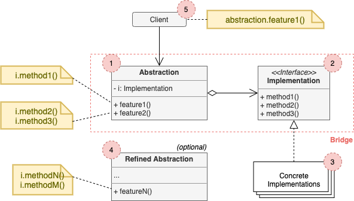

# Adapter

## Concept

_Structural design pattern that lets you split a large class or a set of closely related classes into two separate hierarchies (abstraction and implementation) which can be developed independetly of each other._

### Problem

* You have a geometric `Shape` class with a pair of subclasses `Circle` and `Square`.
* You want to extend this to incorporate colors.
* Adding new shape types and colors to the hierarchy will grow it exponentially.
* Problem caused because we're trying to extend the shape classes in two independent dimensions: form and color.

### Solution

- Switching from inheritance to the object composition.
- Extract one of the 2 dimensions into a separate hierarchy, so that the original classes will reference an object of the new hierarchy, instead of having all of its state and behavior within one class.
- Extract color-related code into its own class with 2 subclasses `Red` and `Blue`.
- The shape delegates the color related work to the linked color object, this reference acts as a bridge between `Shape` and `Color`.

## Definitions

* **Abstraction (Interface):** High-level control layer for some entity. Shouldn't do any real work on its own, but delegate the work to the _implementation layer_(also called _platform_).
* E.g. Abstraction: GUI. Implementation: Underlying OS.

## Structure

1. **Abstraction** provides high-level control logic. Relies on the implementation object to do the actual low-level work.
2. **Implementation** declares the interface that's common for all concrete implementations. An abstraction can only communicate with an implementation object via methods that are declared here.
3. **Concrete Implementations** contain platform-specific code.
4. **Refined Abstractions** provide variants of control logic. Likt their parent, the work with different implementations via the general implementation interface.
5. Usually, the **Client** is only interested in working with the abstraction. However, it's the client's job to link the abstraction object with one of the implementation objects.

## Pros and Cons

### Pros

### Cons
