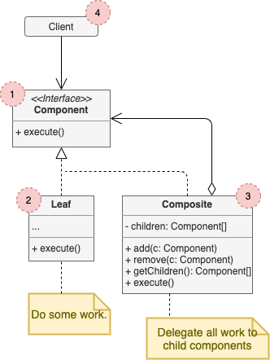

# Composite

## Concept

_Structural design pattern that lets you compose objects into tree structures and then work with these strucutres as if they were individual objects._

### Problem

* Using this pattern makes sense only when the core model of the app can be represented as a tree.
* You have 2 types of objects: `Products` and `Boxes`. A `Box` can contain several `Products` as well as a number of smaller `Boxes`, which can also have `Products` and smaller `Boxes` and so on.
* You decide to create an ordering system that uses these classes. Orders can haev simple products with no wrapping, but also boxes with products and other boxes. **How would you determine the total price of such an order?**. Unwrapping all of the boxes and going over all the products and calculate tht total it's not as simple as running a loop, since you would have to know the classes of `Products` and `Boxes` you're going through, the nesting level of the boxes and other details.

### Solution

- Work with `Products` and `Boxes` through a common interface which declares a method for calculating the toal price.
- The greatest benefit is that you don't need to care about the concrete classes of objects that compose the tree. You can treat them all the same via the common interface. When you call a method the objects themselves pass the request down the tree.

## Structure

1. The **Component** interface describes operations that are common to both simple and complex elements of the tree.
2. The **Leaf** is a basic element of a three that doesn't have sub-elements. Usually these end up doing most of the real work, since they don't have anyone to delegate the work to.
3. The **Container** (aka _composite_) is an element that has sub-elements: leaves or other containers. A container doesn't know the concrete classes of its children. it works with all sub-elements only via the component interface. Upon receiving a request, it delegates the work to its sub-elements, processes intermediate results and the returns the final result to the client.
4. The **Client** works with all elements through the component interface, so it can work in the same way with both simple or complex elements of the tree.

## Pros and Cons

### Pros

* You can work with complex tree structures more conveniently: use polymorphism and recursion to your advantage.
* _Open/Closed Principle_

### Cons

* It might be difficult to provide a common interface for classes whose functionality differs too much. In certain scenarios, you'd need to overgeneralize the component interface, making it harder to comprenhend.
