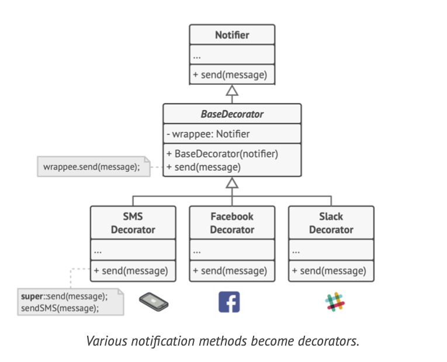
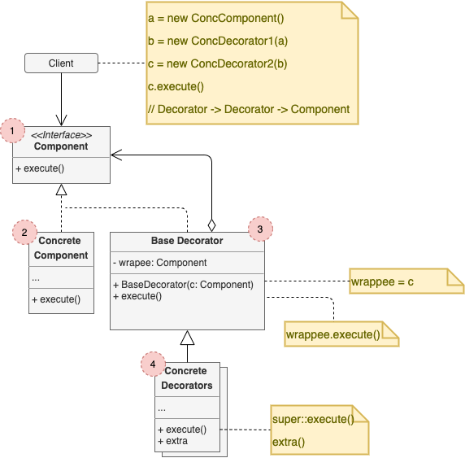

# Adapter

## Concept

_Structural design pattern that lets you attach new behaviors to objects by placing these objects inside special wrapper objects that contain the behaviors._

### Problem

* You're working on a notification library which lets other programs notify their users about important events.
* The initial version was based on the class `Notifier`, which only had a few fields, a constructor and a single `send` method.
* At some point, you realize users expect more than just email notifications, e.g. SMS, Fb messages, Slack.
* Extending the Notifier class works, the client instantiate the desired notification class and use it for all further notifications. But this faces a problem when you need several notification types at once.

## Definitions

* **Aggregation**: Object A contains objects B; B can live without A.
* **Composition**: Object A consists of objects B; A manages life cycle of B; B can't live without A.

### Solution

* Use *Aggregation* or *Composition* instead of *Inheritance*.
* With this new approach you can easliy substitute the linked helper object with another, changing the behavior of the container at runtime.
* A wrapper (decorator) is an object that can be linked with some *target* object. The wrapper contains the same set of methods as the target and delegates to it all requests it receives, but it can alter the result by doing something either before of after it passes the request to the target.

## Structure

1. The **Component** declares the common interface for both wrappers and wrapped objects.
2. **Concrete Component** is a class of objects being wrapped. It defines basic behavior, which can be altered by decorators.
3. The **Base Decorator** has a field for referencing a wrapped object. The field's type should be declared as the component interface so it can contain both concrete components and decorators. Delegates all operations to the wrapped objects.
4. **Concrete Decorators** define extra behaviors that can be added dinamically to components. Override methods of the base decorator and execute their behavior either before or after calling the parent method.
5. The **Client** can wrap components in multiple layers of decorators, as long as it works with all objects via the component interface.

## Pros and Cons

### Pros

* You can extend an object's behavior without making a new subclass.
* You can add or remove responsibilities from an object at runtime.
* You can combine several behaviors by wrapping an object into multiple decorators.
* _Single Responsibility Principle_

### Cons

* It's hard to remove a specific wrapper from the wrappers stack.
* It's hard to implement a decorator in such a way that its behavior doesn't depend on the order in the decorators stack.
* The initial configuration code of layers might look pretty ugly.
