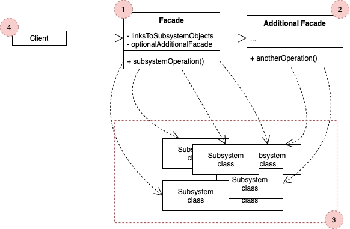

# Facade

## Concept

_Structural design pattern that provides a simplified interface to a library, a framework, or any other complex set of classes._

### Problem

* Imagine you need to work with a sophisticated library or framework. Ordinarily, you'd need to initialize all of those objects, keep track of dependencies, execute methods in the correct order, and so on.
* The bussiness logic of your own classes would become tightly couple to the implementation of the 3rd-party classes, making it hard to comprehend and mantain.

### Solution

* A facade is a class that provides a simple interface to a complex subsystem. It might provide limited functionality in comparison to working with the subsystem directly, but it includes only those features that clients really care about.
* A facade is handy when you need to integrate your app with a sophisitcated library, but you just need a bit of its functionality.

## Structure

1. The **Facade** provides convenient access to a particular part of the subsystem's functionality. Knows where to direct the client's request and how to operate all the moving parts.
2. An **Additional Facade** can be created to prevent polluting a single facade with unrelated features that might make it yet another complex structure. Can be used by both client and other facades.
3. The **Complex Subsystem** consists of dozens of various objects. To make them all do something meaningful, you have to dive deep into the subsystem's implementation details.
4. The **Client** uses the facade instead of calling the subsystem objecst directly.

## Pros and Cons

### Pros

* You can isolate your code from the complexity of a subsystem.

### Cons

* A facade can become a [god object](https://en.wikipedia.org/wiki/God_object) coupled to all classes of an app.
