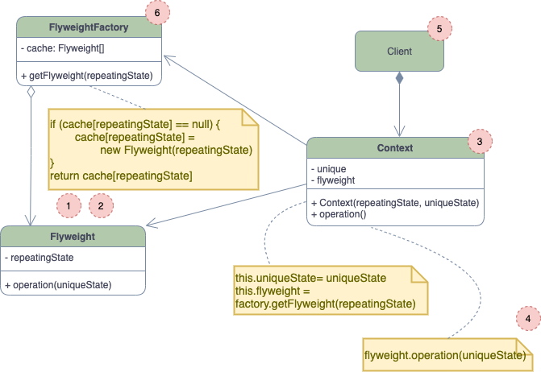

# Flyweight

## Concept

_Structural design pattern that lets you fit more object into the available amount of RAM by sharing common parts of state between multiple objects instead of keeping all of the data in each object._

### Problem

* You decided to create a simple video game: players would be moving around a map and shooting each other. You chose to implement a realistic particle system and make it a distinctive feature of the game. On your computer the game runs perfectly, but on your friend's it keeps crashing after a few minutes of gameplay, because of insufficient amount of RAM.
* The problems comes from the particle system. Each particle, such as a bullet, a missile or a piece of shrapnel was represented by a separate object containing plenty of data.

### Solution

* The `color` and `sprite` fields of the `Particle` class consume a lot more memory than other fields, and they are almost identical across all particles.
* The constant data of an object is usually called the _intrinsic_ state. It lives within the object, other objects can only read it. The rest of the object's state, often altered from the outside, is called the _extrinsic_ state.
* The Flyweight pattern suggests that you stop storing the extrinsic state inside the object. Instead you should pass this state to specific methods which rely on it.

As a result, you'd need fewer of these objects since they only differ in the intrinsic state, which has much fewer variations than the extrinsic.

## Approaches

### Extrinsic state storage

Where does the extrinsic state move to? In most cases, it gets moved to the container object, which aggregates objects before we apply the pattern.

In our case, that's the main `Game` obejct that stores all particles in the `particles` field. To move the extrinsic state into this class, you need to create several array fields for storing coordinates, vectors, and speed of each individual particle. You will also need another array for storign references to a specific flyweight that represents a particle. These must be in sync so that you can access all data of a particle using the same index.

A more elegant solution is to create a separate context class tha would store the extrinsic state along with reference to the flyweight object. This would require having just a single array in the container class.

These objects are much smaller than the objects that we had at the beginning. The most memory-consuming fields have been moved to just a few flyweight objects.

### Flyweight and immutability

Since the same flyweight object can be used in different contexts, you have to make sure that its state can't be modified. Its should be initialized just once, via constructor parameters. It should expose any setters or public fields to other objects.

### Flyweight factory

For more convenient access to various flyweights, you can create a factory method that manages a pool of existing flyweight objects. The method accepts the intrinsic state of the desired flyweight from a client, looks for an existing flyweight object matching this state and return it if found or creates it if not.

## Structure

1. The Flyweight pattern is merely an optimizaton. Before applying it, make sure your program does have the RAM consumption problem related to having a massive number of similar objects in memory at the same time, and that it cannot be solved in a more meaningful way.
2. The **Flyweight** contains the portion of the original object's state that can be shared between multiple objects. The same Flyweight can be used in different contexts.
3. The **Context** class contains the extrinsic state, unique across all original objects. When a context is paired with one of the flyweight objects, it represents the full state of the original object.
4. Usually, the behavior of the original object remains in the flyweight class. in this case, whoever class a flyweight's method must also pass appropiate bits of the extrinsic state into the method's parameter.
5. The **Client** calculates or stores the extrinsic state of flyweights. From the client's perspective, a flyweight is a template object which can be configured at runtime by passing some contextual data into parameters of its method.
6. The **Flyweight Factory** manages a pool of existing flyweights. With the factory, clients don't create flyweights directly. Instead the call the factory, passing it bits of the intrinsic state of the desired flyweight.

## Pros and Cons

### Pros

* You can save lots of RAM, assuming your program has tons of similar objects.

### Cons

* You might be trading RAM over CPU cycles when some of the context data needs to be recalculated each time somebody calls a flyweight method.
* The code becomeds much more complicated.
