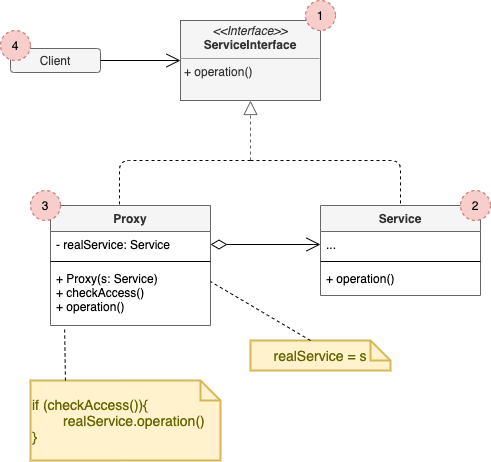

# Proxy

## Concept

_Structural design pattern that lets you provide a substitute or placeholder for another object. A proxy controls access to the original object, allowing you to perform something either before or after the request gets through to the original object._

### Problem

* You have a massive object that consumes a vast amount of system resources. You need it from time to time but not always.
* You could implement lazy initialization: create this object obnly when it's actually needed. All of the object's clients would need to execute some deferred initialization code. Unfortunately, this would probably cause a lot of code duplication.

### Solution

* Create a new proxy class with the same interface as an original service object. Then, update the app, so that it passes the procy object to all of the original object's clients. Upon receiving a request from a client, the proxy creates a real service object and delefates all the work to it.

## Structure

1. The **Service Interface** declares the interface of the Service. The proxy must follow this interface to be able to disguise itself as a service object.
2. The **Service** is a class that provides some useful business logic.
3. The **Proxy** class has a reference field that points to a service object. After the *proxy* finishes its processing (e.g lazy initialization, loggin, access control, caching, etc.), it passes the request to the service object. Usually, proxies manage the full lifecycle of their service object.
4. The **Client** should work with both services and proxies via the same interface. This way you can pass a proxy into any code that expects a service object.

## Pros and Cons

### Pros

* You can control the service object without clients knowing about it.
* You can manage the lifecycle of the service object when clients don’t care about it.
* The proxy works even if the service object isn’t ready or is not available.
* _Open/Closed Principle_. You can introduce new proxies without changing the service or clients.

### Cons

* The code may become more complicated since you need to introduce a lot of new classes.
* The response from the service might get delayed.
